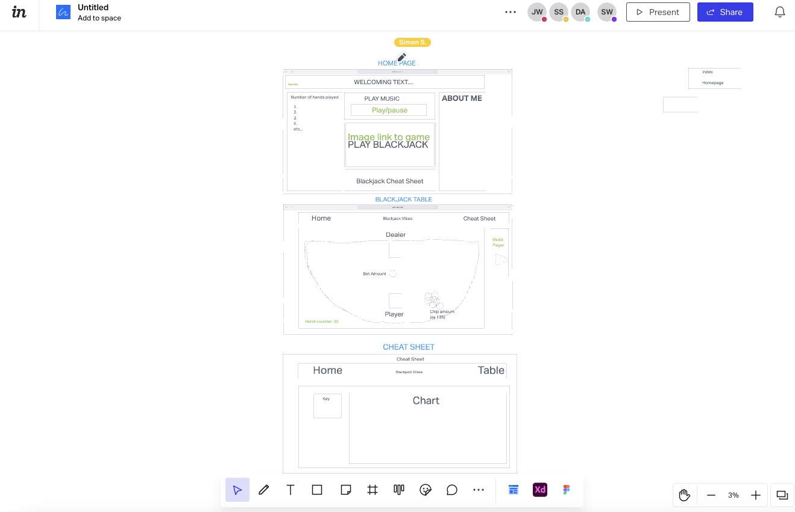
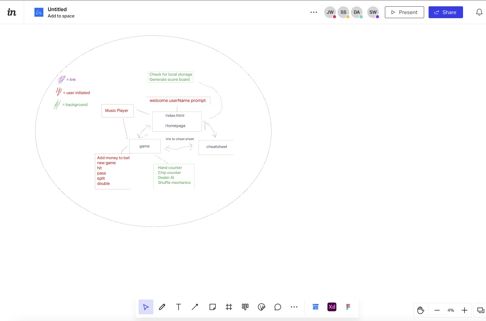

## Vision 

- What is the vision of this product? 
  - We wouild like to creat a website that allows a user to play blackjack and play calming music at the same time. 

- Painpoint
  - It is a great option to fill the time and get better outside of the risk of a casino and can help with stress relief by playing calming music in a low stakes environment. 

- Why should we care about your product?
  - It's a helpful tool for people at any blackjack skill level.
  - Good stress relief tool.

## Scope (In/Out)

- In - what will your product do?
  - Allow user to interface with an ai dealer.
  - Shuffle cards.
  - Plays music
  - Provide a cheat sheet for beginners.
  - Stores chips and game data in local storage.

- Out - what will your product not do?
  - Will never be a phone app. 
  - Wont need a user account just a name. 

## MVP functionality

- Program can sucessfully run blackjack.

## Stretch

- Add different music genre's.
- Make a shuffle animation.

## Functional requirements 

- User can see how many chips they have left and how many hands the user has gone through. 
- User can play and pause music. 
- User will have access to cheatsheet. 
- User can come back to their same game.

